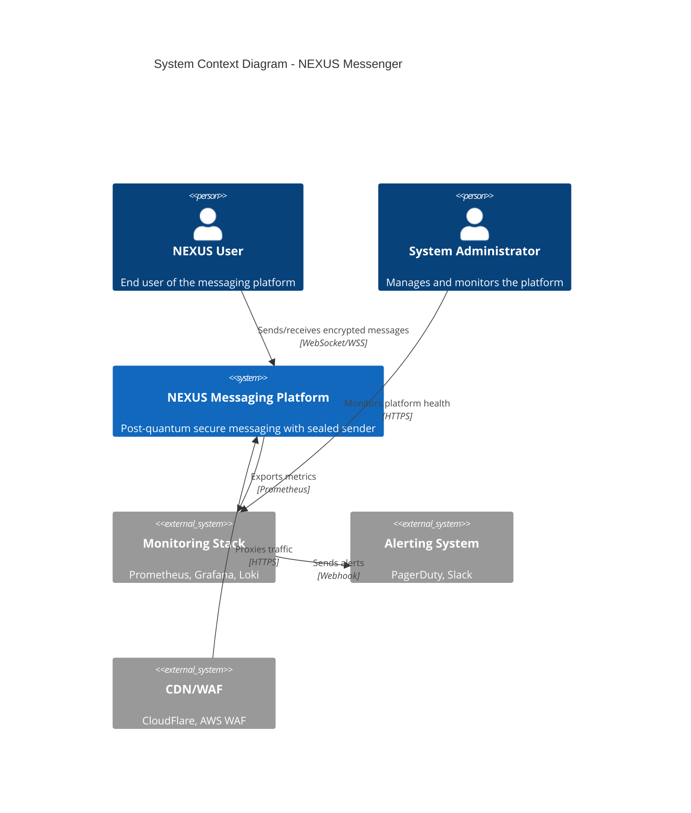
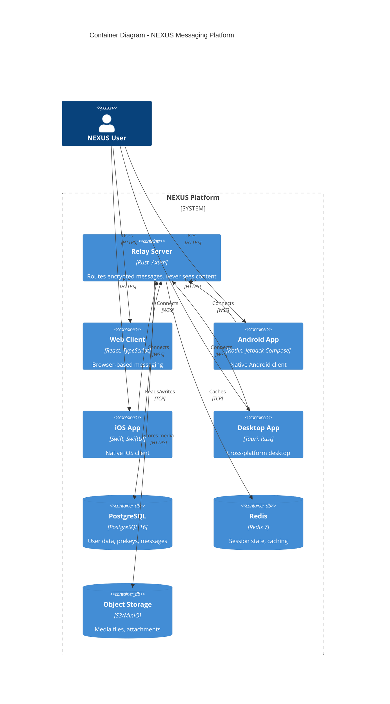
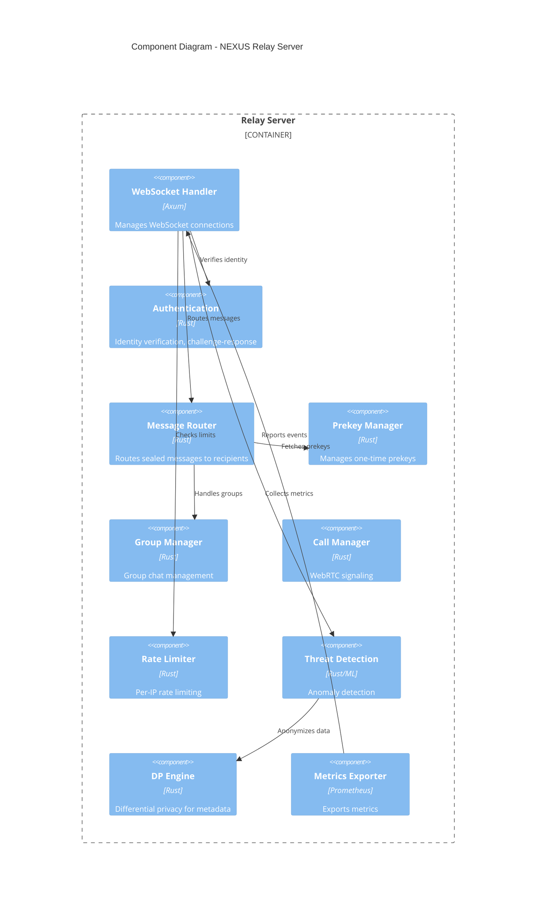
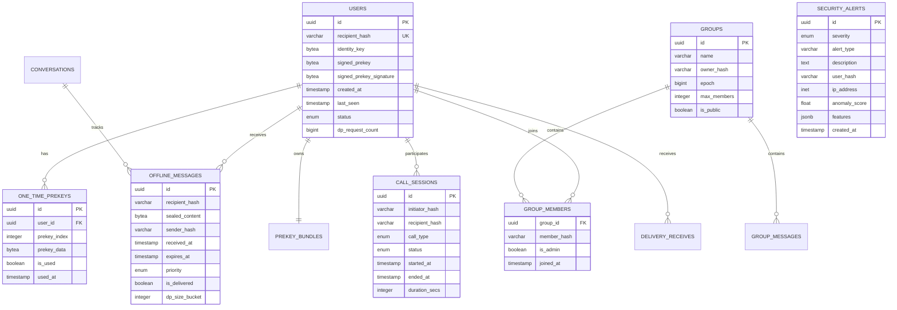
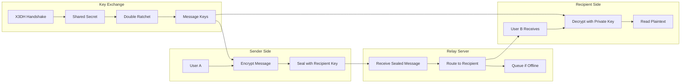
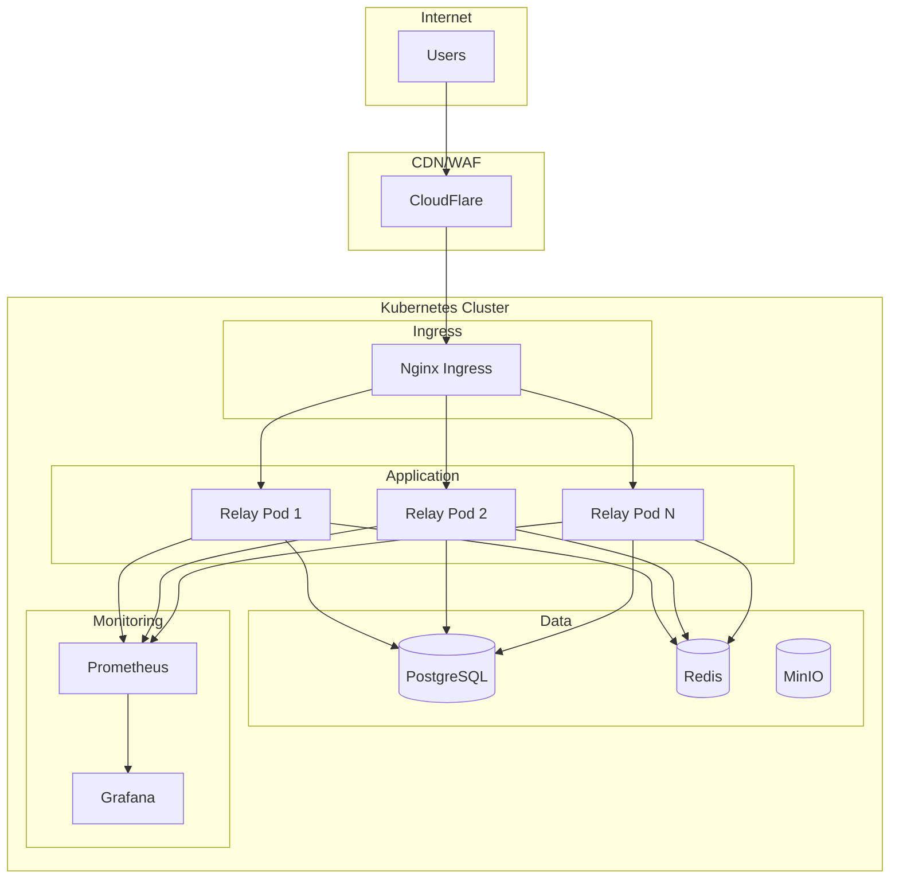

# NEXUS Architecture Diagrams (C4 Model)

## Level 1: System Context

## Level 2: Container Diagram

## Level 3: Component Diagram - Relay Server

## ERD Diagram

## STRIDE Threat Model

```mermaid
graph TD
    subgraph "STRIDE Analysis - NEXUS"
        S[Spoofing] --> S1[Identity impersonation]
        S --> S2[Man-in-the-middle]
        S --> S3[Prekey substitution]
        
        T[Tampering] --> T1[Message modification]
        T --> T2[Key manipulation]
        T --> T3[Database corruption]
        
        R[Repudiation] --> R1[Message denial]
        R --> R2[Action denial]
        
        I[Information Disclosure] --> I1[Metadata leakage]
        I --> I2[Key extraction]
        I --> I3[Traffic analysis]
        
        D[Denial of Service] --> D1[Connection flood]
        D --> D2[Message spam]
        D --> D3[Resource exhaustion]
        
        E[Elevation of Privilege] --> E1[Admin access]
        E --> E2[Group privilege escalation]
        E --> E3[Session hijacking]
    end
    
    subgraph "Mitigations"
        S1 --> M1[X3DH identity binding]
        S2 --> M2[TLS + certificate pinning]
        S3 --> M3[Prekey signatures]
        
        T1 --> M4[AEAD encryption]
        T2 --> M5[Secure key storage]
        T3 --> M6[Database integrity checks]
        
        I1 --> M7[Sealed sender + DP]
        I2 --> M8[Hardware security modules]
        I3 --> M9[Traffic padding]
        
        D1 --> M10[Rate limiting]
        D2 --> M11[Message quotas]
        D3 --> M12[Resource limits]
        
        E1 --> M13[RBAC + audit logging]
        E2 --> M14[Group permission checks]
        E3 --> M15[Session binding]
    end
```

## Data Flow Diagram (DFD)

## Deployment Diagram

